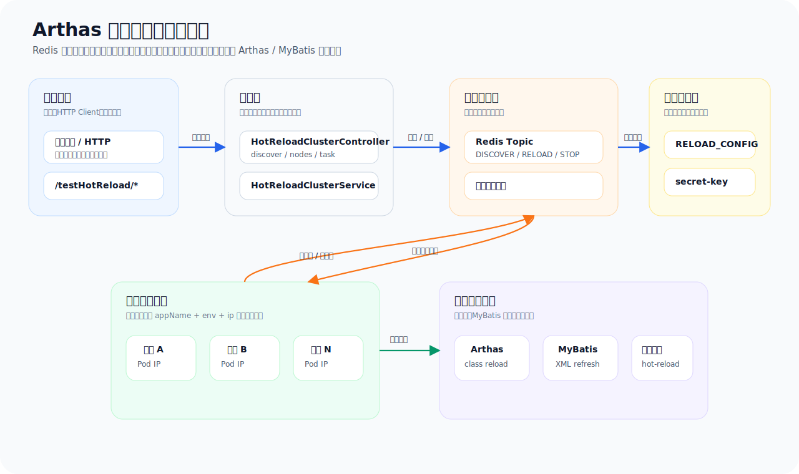
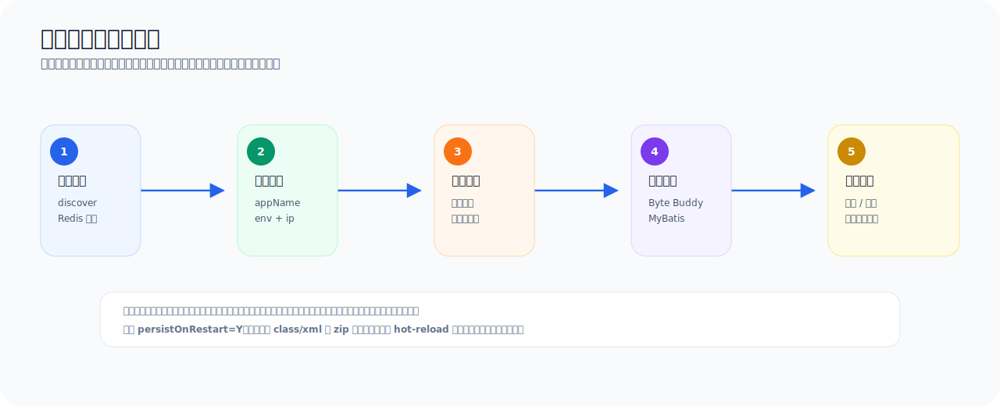

<h1 align="center">cluster-hot-reload-demo</h1>

<p align="center">
  <strong>Arthas 集群热重载示例：Redis 广播任务，数据库记录过程，节点本机执行热更新</strong>
</p>

<p align="center">
  
  
  
  
  
</p>

<p align="center">
  <a href="README.md">中文</a> | <a href="README_EN.md">English</a>
</p>

基于 Arthas、Redis 发布订阅和关系型数据库任务日志实现的 Spring Boot 集群热重载示例项目。

这个项目用于演示：在不重启服务的情况下，把指定的 `.class` 或 MyBatis Mapper XML 文件下发到一个或多个 Spring Boot 服务节点，并让每个节点在本机执行热重载，同时把执行状态和结果写入数据库，方便页面查询和失败重试。

## 分支说明

- `main`：默认分支，使用 Byte Buddy Agent 和 JVM Instrumentation 执行 class 热重载。
- `arthas`：当前分支，保留 Arthas HTTP API 执行 class 热重载的完整实现。

## 能力速览

| 能力 | 说明 |
| --- | --- |
| 节点发现 | 通过 Redis 广播刷新节点，节点按 `appName + env + ip` 注册到 Redis |
| 指定节点下发 | 页面传入目标 IP 列表，只让选中的节点执行 |
| 多类型热重载 | 支持 JVM class、MyBatis Mapper XML |
| 过程可追踪 | 数据库记录任务、补丁文件、每个节点的实例状态和执行结果 |
| 失败可重试 | 失败、预检查失败、超时的节点实例可重新广播执行 |
| 重启自动恢复 | 可选择保存本地恢复文件，服务重启后自动重新热重载 |
| 停止自动恢复 | 可按文件类型删除本地恢复文件，停止后续重启自动恢复 |
| 多数据库脚本 | 内置 MySQL、PostgreSQL、Oracle、SQL Server 初始化脚本 |

## 项目背景

单体服务里使用 Arthas 热重载一个类比较直接：找到目标 JVM，执行 class retransform 或刷新 MyBatis Mapper XML 即可。

但服务部署成集群后，会多出几个问题：

- 用户需要知道当前有哪些服务节点可以执行热重载。
- 一次热重载可能只针对部分节点，而不是整个服务集群。
- 每个节点是否收到任务、是否执行成功、失败原因是什么，都需要可查询。
- 如果容器重启后仍希望保留本次热重载，需要有本地恢复机制。
- 如果不再需要重启自动恢复，也需要能按类型停止恢复文件。

本项目给出一个可运行的示例方案：

1. 页面或调用方先刷新节点信息。
2. 服务节点通过 Redis 广播上报自己的 `appName + env + ip`。
3. 用户选择目标 IP 创建热重载任务。
4. 任务、补丁文件、节点执行实例写入数据库。
5. Redis 发布任务通知。
6. 目标节点从数据库拉取任务和文件，在本机执行 Arthas/MyBatis 热重载。
7. 节点把执行结果写回数据库，页面按任务或日志接口查询。

## 可以达到什么目的

- 演示使用统一的 `CLASS` 类型热重载 Spring 管理类和普通 Java 类的方法体。
- 演示 MyBatis Mapper XML SQL 热重载。
- 演示集群节点发现和指定节点下发。
- 演示节点级任务实例状态记录、失败重试和日志查询。
- 演示容器或进程重启后的本地恢复。
- 演示停止重启自动恢复，避免非容器环境中历史热重载文件长期生效。

这个项目定位是学习和二次开发模板，不建议直接作为生产权限模型使用。生产环境应接入自己的登录态、审批流、审计、权限和发布管控。

## 技术栈

- Java 8+，已使用 JDK 17 编译验证
- Spring Boot 2.7.13
- Arthas 3.7.2
- Redis 发布订阅
- MySQL、PostgreSQL、Oracle、SQL Server
- MyBatis-Plus
- Springfox Swagger

## 整体架构

<p align="center">
  
</p>

核心设计：

- Redis 只负责广播通知，不保存完整任务内容。
- 数据库保存任务主表、上传文件、节点实例执行日志。
- 节点收到 Redis 通知后，从数据库拉取任务和文件。
- 节点是否执行由 `appName + env + ip` 判断。
- 同一个节点本地使用锁避免并发热重载。
- 节点状态由 Redis 注册信息的 `updateTime` 动态计算，超过 30 分钟视为 `EXPIRED`。

## 执行流程

<p align="center">
  
</p>

## 目录说明

```text
src/main/java/io/github/hotreload/demo
├── config
│   ├── mybatis      MyBatis-Plus 配置
│   ├── redis        Redis 发布订阅配置和监听器
│   └── reload       热重载配置和简单密钥校验
├── controller       单机热重载接口和集群热重载接口
├── core
│   ├── cluster      节点信息、常量
│   ├── message      Redis 消息对象
│   ├── recovery     重启恢复文件保存、恢复、停止恢复
│   └── runtime      Arthas class 重载和 MyBatis XML 刷新
├── entity           数据库表实体
├── mapper           MyBatis-Plus Mapper
├── service          集群热重载业务流程
├── test             热重载验证接口和测试类
├── util             工具类
└── vo               接口请求和响应对象

src/main/resources
├── mapper           Mapper XML
└── sql              多数据库初始化脚本

http                 IDEA HTTP Client 调用示例
```

## 配置说明

默认配置在 `src/main/resources/application.yml`：

```yaml
server:
  port: 8080

spring:
  application:
    name: cluster-hot-reload-demo
  profiles:
    active: local,mysql
  redis:
    host: 127.0.0.1
    port: 6379
    password: root
  datasource:
    hikari:
      connection-timeout: 5000
      initialization-fail-timeout: 1

arthas:
  ip: 127.0.0.1
  http-port: 8563
  output-path: ${java.io.tmpdir}/arthas-output/${spring.application.name}

hot-reload:
  redis-topic: HOT_RELOAD_TOPIC
  secret-key: demo-hot-reload
  arthas-init-wait-ms: 5000
```

说明：

- `spring.application.name` 是服务模块标识，集群场景用它区分不同服务。
- `spring.profiles.active` 的第一个值会作为 `env`。
- 节点 IP 由 `io.github.hotreload.demo.util.SystemUtils#getLocalIP()` 获取，设计目的是在容器部署时拿到当前服务实例的 Pod IP。不同公司和部署环境的网卡、Sidecar、Service Mesh、主机网络配置不一样，接入真实项目时应按自己的运行环境替换为可靠的服务实例 IP 获取方式。
- `spring.datasource.hikari.initialization-fail-timeout` 用于保证数据库连接初始化失败时直接启动失败。
- `arthas.output-path` 是 Arthas 命令输出目录。Arthas 启动时一定会创建输出目录，demo 将它放到系统临时目录，避免在项目根目录生成 `arthas-output`。
- `hot-reload.redis-topic` 是 Redis 广播主题。
- `hot-reload.database-type` 控制 MyBatis-Plus 分页方言，默认 MySQL。
- 单机热重载接口使用请求头 `hot-reload-secret` 做简单保护。

数据库连接放在独立 profile 中：

| 数据库 | Spring profile | Maven profile | database-type | SQL 目录 |
| --- | --- | --- | --- | --- |
| MySQL | `mysql` | `mysql`，默认启用 | `MYSQL` | `src/main/resources/sql/mysql` |
| PostgreSQL | `postgresql` | `postgresql` | `POSTGRESQL` | `src/main/resources/sql/postgresql` |
| Oracle | `oracle` | `oracle` | `ORACLE_12C` | `src/main/resources/sql/oracle` |
| SQL Server | `sqlserver` | `sqlserver` | `SQL_SERVER` | `src/main/resources/sql/sqlserver` |

默认 `spring.profiles.active=local,mysql`，第一个 profile 仍是 `local`，所以节点 `env` 不会因为数据库 profile 改成 `mysql`。

## 数据库准备

项目不会自动执行 SQL：

```yaml
spring:
  sql:
    init:
      mode: never
```

需要手动创建数据库并执行脚本。

MySQL 可先创建库：

```sql
CREATE DATABASE IF NOT EXISTS hot_reload_demo
  DEFAULT CHARACTER SET utf8mb4
  DEFAULT COLLATE utf8mb4_general_ci;
```

不同数据库按对应目录顺序执行：

```text
src/main/resources/sql/{database}/schema.sql
src/main/resources/sql/{database}/data.sql
```

例如 MySQL：

```text
src/main/resources/sql/mysql/schema.sql
src/main/resources/sql/mysql/data.sql
```

Oracle 脚本默认面向空 schema 执行；如果重复执行，需要先手动删除表或按实际环境改成自己的幂等建表脚本。

### 数据库兼容性说明

核心任务查询和写入主要使用 MyBatis-Plus `BaseMapper`、`LambdaQueryWrapper`、`LambdaUpdateWrapper`，没有在业务代码中绑定某个数据库的分页 SQL 或日期函数。

多数据库支持依赖这几部分配合：

- Maven profile 提供目标数据库 JDBC 驱动。
- Spring profile 提供目标数据库连接地址。
- `hot-reload.database-type` 提供 MyBatis-Plus 分页方言。
- `sql/{database}` 提供目标数据库建表和初始化脚本。
- `TestHotReloadMapper.xml` 使用 MyBatis `databaseId` 区分演示 SQL 中的时间函数。

接入其它数据库时，优先检查字段类型映射、分页方言、二进制字段类型和初始化数据时间函数。

### MyBatis 动态数据源

MyBatis XML 热重载刷新的是当前项目唯一 `SqlSessionFactory` 的 `Configuration`。如果业务项目使用一个 `SqlSessionFactory` 搭配动态数据源路由，仍然只需要刷新这个工厂；真正执行 SQL 时走哪个数据库，由项目自己的数据源切面或路由数据源负责。

主要表：

- `T_SYS_CONFIG`：配置主表。
- `T_SYS_CONFIG_DETAIL`：配置明细表，保存热重载开关和页面服务下拉配置。
- `T_HOT_RELOAD_TASK`：集群热重载任务主表。
- `T_HOT_RELOAD_FILE`：上传的 class 或 XML 文件内容。
- `T_HOT_RELOAD_TASK_INSTANCE`：每个目标节点的执行日志。

初始化数据里包含：

- `RELOAD_SWITCH=Y`：热重载总开关。
- `RELOAD_SERVICE`：页面可选择的应用列表，`detail_value` 是 JSON 数组。

`RELOAD_SERVICE` 示例：

```json
[
  {
    "appName": "cluster-hot-reload-demo",
    "nodeTotal": "2"
  }
]
```

字段说明：

- `appName`：服务应用名称，需要与 `spring.application.name` 一致。
- `nodeTotal`：该服务预期节点数量，主要给页面展示和人工核对使用；实际可操作节点仍以 discover 后 Redis 中返回的节点列表为准。

## 启动项目

先启动数据库和 Redis，然后按目标数据库选择 Maven profile 和 Spring profile。

MySQL 默认启动：

```bash
mvn -DskipTests compile
mvn spring-boot:run
```

PostgreSQL 示例：

```bash
mvn -Ppostgresql -DskipTests compile
mvn -Ppostgresql spring-boot:run -Dspring-boot.run.profiles=local,postgresql
```

Oracle 示例：

```bash
mvn -Poracle -DskipTests compile
mvn -Poracle spring-boot:run -Dspring-boot.run.profiles=local,oracle
```

SQL Server 示例：

```bash
mvn -Psqlserver -DskipTests compile
mvn -Psqlserver spring-boot:run -Dspring-boot.run.profiles=local,sqlserver
```

启动后可访问：

- Swagger：`http://localhost:8080/swagger-ui/`
- 测试接口：`http://localhost:8080/testHotReload/all?userId=1001&value=`

如果使用 IDEA，可以直接打开 `http` 目录下的请求文件执行示例。

## 热重载验证文件

项目内置了用于演示的原始测试类：

- `io.github.hotreload.demo.test.TestHotReloadServiceImpl`
- `io.github.hotreload.demo.test.TestHotReloadUtil`
- `mapper/TestHotReloadMapper.xml`

对应的“重载后”上传文件放在：

```text
src/main/java/io/github/hotreload/demo/test/reload-after
```

包含：

- `TestHotReloadServiceImpl.class`
- `TestHotReloadUtil.class`
- `TestHotReloadMapper.xml`

验证方式：

1. 先调用 `/testHotReload/all?userId=1001&value=` 记录热重载前结果。
2. 上传 `reload-after` 目录下的对应文件执行热重载。
3. 再调用 `/testHotReload/all?userId=1001&value=` 观察返回值变化。

## 单机热重载使用

单机接口不依赖 Redis 广播和数据库任务表，适合先验证 Arthas 和运行时重载能力。

接口：

```text
POST /standaloneHotReload/hot-reload/all
```

请求头：

```text
hot-reload-secret: demo-hot-reload
```

支持参数：

- `file`：上传的 `.class` 或 `.xml` 文件，服务端根据文件后缀识别为 `CLASS` 或 `MYBATIS_XML`。

示例文件：

```text
http/standalone-hot-reload.http
```

单机接口还提供 Arthas 命令调用：

```text
POST /standaloneHotReload/hot-reload/command
```

示例：

```json
{
  "command": "jad io.github.hotreload.demo.test.TestHotReloadServiceImpl"
}
```

## 集群热重载使用

集群热重载完整流程如下。

### 1. 查询可热重载应用

```text
POST /hotReloadCluster/apps
```

数据来自 `T_SYS_CONFIG_DETAIL` 中的 `RELOAD_CONFIG / RELOAD_SERVICE`。其中 `nodeTotal` 表示页面配置的预期节点数量，方便页面展示“应有节点数”和人工判断节点发现是否完整。

### 2. 刷新目标应用节点

```text
POST /hotReloadCluster/discover?appName=cluster-hot-reload-demo
```

调用后会向 Redis 发送 `DISCOVER_REQUEST` 消息。匹配 `appName + env` 的节点会把当前节点信息写入 Redis：

```text
hotreload:{env}:{appName}:nodes
```

### 3. 查询节点列表

```text
POST /hotReloadCluster/nodes?appName=cluster-hot-reload-demo
```

返回字段包括：

- `appName`：应用名称。
- `env`：运行环境。
- `ip`：节点 IP。
- `updateTime`：节点最近上报时间。
- `nodeStatus`：`ONLINE` 或 `EXPIRED`。
- `hotReloadStatus`：最近热重载状态。
- `lastTaskId`：最近执行任务 ID。

节点超过 30 分钟未刷新会显示为 `EXPIRED`。

### 4. 创建集群热重载任务

```text
POST /hotReloadCluster/task/create
Content-Type: multipart/form-data
```

表单字段：

- `file`：上传的 `.class` 或 `.xml` 文件，服务端根据文件后缀识别为 `CLASS` 或 `MYBATIS_XML`。
- `request`：JSON 字符串。

`request` 示例：

```json
{
  "appName": "cluster-hot-reload-demo",
  "persistOnRestart": "N",
  "ips": [
    "198.18.0.1"
  ],
  "taskRemark": "演示集群热重载普通工具类"
}
```

字段说明：

- `appName`：目标服务模块，必填。
- `persistOnRestart`：是否在服务重启后自动恢复本次热重载，支持 `Y/N`。
- `ips`：目标节点 IP 列表。
- `taskRemark`：任务备注。

### 5. 查询任务详情

```text
POST /hotReloadCluster/task/get
```

请求体：

```json
{
  "taskId": "TASK-20260629120000-00000000"
}
```

### 6. 分页查询任务日志

```text
POST /hotReloadCluster/task/log/page
```

请求体示例：

```json
{
  "pageStart": 1,
  "pageNums": 10,
  "requestVo": {
    "appName": "cluster-hot-reload-demo",
    "env": "local",
    "reloadType": "CLASS"
  }
}
```

### 7. 重试失败节点

```text
POST /hotReloadCluster/task/retry
```

请求体：

```json
{
  "taskId": "TASK-20260629120000-00000000",
  "ips": [
    "198.18.0.1"
  ]
}
```

只会重试失败、预检查失败或超时的节点实例。

## 重启自动恢复

当创建任务时传入：

```json
{
  "persistOnRestart": "Y"
}
```

节点热重载成功后，会把文件保存到本地 `hot-reload` 目录：

```text
hot-reload/
├── class
│   ├── TestHotReloadServiceImpl.zip
│   └── TestHotReloadUtil.zip
└── mybatis-xml
    └── TestHotReloadMapper.zip
```

恢复文件是标准 zip 压缩包，内部保存 `meta.json` 和上传原文件。上传文件在 zip 中保持原文件名和原始字节内容，不会改名为 `payload`，也不会经过字符串转换。服务启动后，`HotReloadRecoveryRunner` 会扫描这些文件并重新执行热重载，恢复结果写入 `T_HOT_RELOAD_TASK_INSTANCE`，执行类型为 `RECOVER`。

自动恢复依赖本地 `hot-reload` 目录仍然存在。以容器部署为例，如果只是当前容器节点重启且工作目录文件仍保留，启动后可以自动恢复；如果是重新发布镜像、Pod 被重建、工作目录被清空，恢复文件会消失，也就不会再自动恢复。

需要注意：

- 只有热重载任务执行成功，并且 `persistOnRestart=Y`，才会保存恢复文件。
- `persistOnRestart=N` 不会保存恢复文件，并会删除同名恢复文件，避免旧文件在下次启动时被恢复。
- 自动恢复仍受 JVM 热重载限制影响，新增字段、方法、Bean、Controller 路由等结构性变化不会因为重启恢复而变成可支持。
- 非容器或固定机器部署时，本地 `hot-reload` 目录可能长期保留，应在不需要时调用停止重启自动恢复接口清理。

## 停止重启自动恢复

如果不希望历史热重载文件在后续重启时继续生效，可以调用：

```text
POST /hotReloadCluster/restartRecovery/stop
```

请求体：

```json
{
  "appName": "cluster-hot-reload-demo",
  "fileType": "*",
  "ips": [
    "198.18.0.1"
  ],
  "taskRemark": "停止全部热重载内容的重启自动恢复"
}
```

`fileType` 支持：

- `*`：全部类型。
- `CLASS`：JVM class。
- `MYBATIS_XML`：MyBatis Mapper XML。

该接口的含义是停止重启自动恢复，本质是删除目标节点本地 `hot-reload` 目录下对应类型的 zip 恢复包。

## 支持范围

| 类型 | 支持范围 | 说明 |
| --- | --- | --- |
| JVM class | Spring 管理类、工具类以及其他已经加载的 Java 类 | 统一使用 `CLASS` 类型替换已有方法体，不需要额外类型或 Bean 参数 |
| MyBatis Mapper XML | `select`、`insert`、`update`、`delete` SQL | 支持修改 SQL、增删 statement、修改 resultMap |

## 不支持范围

这些限制主要来自 JVM Instrumentation `retransformClasses`：

| 不支持操作 | 原因 |
| --- | --- |
| 新增或删除字段 | JVM 不允许改变类内存布局 |
| 新增或删除方法 | JVM 不允许改变类结构 |
| 修改方法签名 | 参数或返回值变化属于类结构变化 |
| 新增 `@Autowired` 字段注入 | Spring 容器不会重新完成依赖注入 |
| 修改继承关系或接口实现 | JVM 不允许改变类层次结构 |
| Controller 路由变更 | Spring MVC 路由在启动时注册，热重载不会重新注册 |
| 新增 Spring Bean | Spring 容器不会感知新类，需要重启 |

## Redis 消息类型

项目使用一个 Redis Topic，通过 `messageType` 区分功能：

- `DISCOVER_REQUEST`：节点发现。
- `RELOAD_TASK_NOTIFY`：热重载任务通知。
- `STOP_RECOVERY_TASK_NOTIFY`：停止重启自动恢复通知。

Redis Topic 默认：

```text
HOT_RELOAD_TOPIC
```

## 常见问题

### Redis 节点 IP 为什么不是 127.0.0.1？

节点 IP 来自 `io.github.hotreload.demo.util.SystemUtils#getLocalIP()`。这个方法在 demo 中用于获取容器内当前服务实例的 Pod IP，所以在本机、WSL、镜像网络、VPN 或多网卡环境中，返回值可能是当前优先网卡地址，而不是 `127.0.0.1`。

真实项目接入时不要直接假设这个方法一定适用，应结合部署方式确定服务实例 IP，例如 Kubernetes Pod IP、注册中心实例 IP、容器环境变量、平台注入的实例地址等。热重载任务能否下发到目标节点，最终取决于页面传入的 IP 是否能和节点本机识别出的 IP 一致。

### 启动时提示 Redis 或数据库连接失败怎么办？

Redis 发布订阅和关系型数据库都是集群热重载的核心依赖。默认配置下，Redis 或数据库连接失败时项目会启动失败，这是预期行为。

排查点：

- 确认 Redis 已启动，并且 `spring.redis.host`、`spring.redis.port`、`spring.redis.password` 与实际环境一致。
- 默认密码是 `root`，如果本地 Redis 没有密码，需要删除或覆盖 `spring.redis.password`。
- 确认当前启用的数据库 profile 正确，例如默认是 `local,mysql`。
- 确认数据库服务已启动，库名、用户名、密码和 JDBC URL 与对应 `application-{database}.yml` 一致。
- 如果刚切换数据库类型，需要同时切换 Maven profile、Spring profile、`hot-reload.database-type` 和对应 SQL 脚本。

### 自动恢复为什么没有生效？

先确认本次任务是否满足保存恢复文件的条件：任务执行成功、`persistOnRestart=Y`、本地 `hot-reload` 目录下有对应的 zip 恢复包。

常见原因：

- 服务是重新发布或 Pod 重建，原容器工作目录被清空，恢复文件已经不存在。
- 任务执行失败，没有进入保存恢复文件逻辑。
- 创建任务时传了 `persistOnRestart=N`，系统不会保存恢复文件，并会删除同名恢复文件。
- 已调用停止重启自动恢复接口，对应类型的恢复文件被删除。
- 上传的 class 发生了 JVM 不支持的结构性变化，启动恢复时仍会失败。

### nodes 返回节点数和 nodeTotal 不一致怎么办？

`nodeTotal` 来自数据库 `RELOAD_SERVICE` 配置，是页面展示用的预期节点数；`nodes` 返回的是 Redis 中当前发现到的节点。两者不一致时，应以 Redis 节点列表作为实际可下发范围。

常见排查点：

- 是否已经调用 `/hotReloadCluster/discover` 刷新节点。
- 目标服务的 `spring.application.name` 是否和数据库 `appName` 一致。
- 目标服务的 `spring.profiles.active` 是否和当前环境一致。
- 所有节点是否连接同一个 Redis，并监听同一个 `hot-reload.redis-topic`。
- 节点本机识别出的 IP 是否和页面要下发的 IP 口径一致。

### 集群热重载任务为什么某个节点不执行？

节点收到 Redis 消息后，会用 `appName + env + ip` 判断是否属于自己。任意一个字段不一致，节点都会忽略该任务。

优先检查：

- `appName` 是否等于目标服务的 `spring.application.name`。
- `env` 是否等于目标服务 active profile 的第一个值。
- 页面传入的 `ips` 是否包含该节点通过 `SystemUtils#getLocalIP()` 获取到的 IP。
- Redis Topic 是否一致。
- 数据库中是否已经生成该 IP 对应的任务实例记录。

## HTTP 示例

IDEA HTTP Client 示例在：

- `http/test-hot-reload.http`
- `http/standalone-hot-reload.http`
- `http/hot-reload-cluster.http`

建议验证顺序：

1. 执行 `test-hot-reload.http` 查看热重载前结果。
2. 执行 `hot-reload-cluster.http` 中的 discover 和 nodes。
3. 把 nodes 返回的 IP 填到 `targetIp`。
4. 执行 class 或 MyBatis XML 热重载任务。
5. 再执行 `test-hot-reload.http` 查看结果变化。
6. 查询任务详情或日志分页，确认数据库中的实例执行结果。
