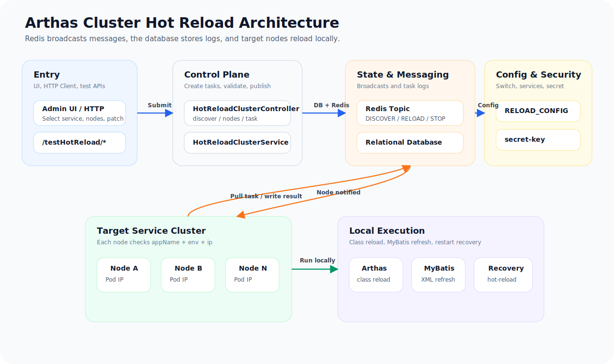
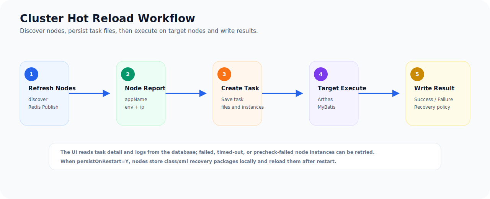

<h1 align="center">arthas-cluster-hot-reload-demo</h1>

<p align="center">
  <strong>Cluster hot reload demo based on Arthas, Redis broadcast, and database execution logs</strong>
</p>

<p align="center">
  
  
  
  
  
</p>

<p align="center">
  <a href="README.md">中文</a> | <a href="README_EN.md">English</a>
</p>

This is a Spring Boot cluster hot reload demo built with Arthas, Redis Pub/Sub, and relational database execution logs.

It demonstrates how to send a `.class` file or a MyBatis Mapper XML file to one or more Spring Boot service instances, reload it locally on each selected node without restarting the service, and write every task and node-level execution result back to the database.

## Features

| Feature | Description |
| --- | --- |
| Node discovery | Refresh nodes through Redis broadcast. Nodes register with `appName + env + ip`. |
| Targeted dispatch | The caller passes an IP list. Only selected nodes execute the task. |
| Multiple reload types | Supports Spring Bean class, plain Java class, and MyBatis Mapper XML. |
| Traceable process | Tasks, uploaded files, node instances, statuses, errors, and reload results are stored in the database. |
| Failure retry | Failed, pre-check failed, or timeout node instances can be retried. |
| Restart recovery | A successful reload can be saved locally and replayed after service restart. |
| Stop recovery | Local recovery packages can be deleted by file type to stop future restart recovery. |
| Multi-database scripts | Includes MySQL, PostgreSQL, Oracle, and SQL Server initialization scripts. |

## Background

Hot reloading a class in a single JVM is straightforward: find the target JVM and use Arthas `retransform`, or refresh a MyBatis Mapper XML in memory.

In a service cluster, several extra problems appear:

- Users need to know which service nodes are available.
- One reload may target only part of the cluster.
- Each node must expose whether it received the task, executed it successfully, and why it failed.
- If a container or process restarts, selected hot reload changes may need to be restored automatically.
- If automatic restart recovery is no longer needed, local recovery files must be removable by type.

This project provides a runnable reference workflow:

1. The UI or caller refreshes target node information.
2. Service nodes receive a Redis discovery broadcast and register `appName + env + ip` into Redis.
3. The user selects target IPs and creates a hot reload task.
4. The task, uploaded file, and node execution instances are stored in the database.
5. Redis publishes the task notification.
6. Target nodes pull task details and files from the database, then run Arthas or MyBatis reload locally.
7. Each node writes the execution result back to the database. The UI queries task details or logs.

## What It Demonstrates

- Spring Bean method-body hot reload.
- Plain Java class method-body hot reload.
- MyBatis Mapper XML SQL hot reload.
- Cluster node discovery and targeted node dispatch.
- Node-level task instance status, retry, and log query.
- Local restart recovery after process or container restart.
- Stopping restart recovery to avoid stale local reload files on non-container deployments.

This project is intended for learning and secondary development. It is not a production-ready permission model. Production usage should integrate your own authentication, approval flow, audit trail, authorization, and release control.

## Tech Stack

- Java 8+, verified with JDK 17
- Spring Boot 2.7.13
- Arthas 3.7.2
- Redis Pub/Sub
- MySQL, PostgreSQL, Oracle, SQL Server
- MyBatis-Plus
- Springfox Swagger

## Architecture

<p align="center">
  
</p>

Core design:

- Redis only broadcasts notifications. It does not store full task content.
- The database stores tasks, uploaded files, and node execution logs.
- A node pulls task details and file content from the database after receiving a Redis message.
- A node decides whether to execute by comparing `appName + env + ip`.
- Each node uses a local lock to avoid concurrent hot reload execution.
- Node status is calculated from Redis registration `updateTime`; nodes older than 30 minutes are considered `EXPIRED`.

## Workflow

<p align="center">
  
</p>

## Project Layout

```text
src/main/java/io/github/hotreload/demo
├── config
│   ├── mybatis      MyBatis-Plus configuration
│   ├── redis        Redis Pub/Sub configuration and listener
│   └── reload       Hot reload configuration and simple secret check
├── controller       Standalone and cluster hot reload APIs
├── core
│   ├── cluster      Node information and constants
│   ├── message      Redis message objects
│   ├── recovery     Restart recovery file store, runner, and cleanup
│   └── runtime      Arthas class reload and MyBatis XML refresh
├── entity           Database table entities
├── mapper           MyBatis-Plus mappers
├── service          Cluster hot reload workflow
├── test             Test APIs and sample reload targets
├── util             Utilities
└── vo               Request and response objects

src/main/resources
├── mapper           Mapper XML files
└── sql              Multi-database initialization scripts

http                 IDEA HTTP Client examples
```

## Configuration

Default configuration is in `src/main/resources/application.yml`:

```yaml
server:
  port: 8080

spring:
  application:
    name: arthas-cluster-hot-reload-demo
  profiles:
    active: local,mysql
  redis:
    host: 127.0.0.1
    port: 6379
    password: root
  datasource:
    hikari:
      connection-timeout: 5000
      initialization-fail-timeout: 1

arthas:
  ip: 127.0.0.1
  http-port: 8563
  output-path: ${java.io.tmpdir}/arthas-output/${spring.application.name}

hot-reload:
  redis-topic: HOT_RELOAD_TOPIC
  secret-key: demo-hot-reload
  arthas-init-wait-ms: 5000
```

Notes:

- `spring.application.name` is the service module identifier used in cluster scenarios.
- The first value in `spring.profiles.active` is used as `env`.
- Node IP is resolved by `io.github.hotreload.demo.util.SystemUtils#getLocalIP()`. It is intended to get the current service instance Pod IP in container deployments. Real projects should replace it with a reliable instance IP strategy for their own network, sidecar, service mesh, and deployment model.
- `spring.datasource.hikari.initialization-fail-timeout` makes startup fail if the database connection cannot be initialized.
- `arthas.output-path` is the Arthas command output directory. Arthas always creates an output directory on startup. This demo moves it to the system temp directory to avoid creating `arthas-output` under the project root.
- `hot-reload.redis-topic` is the Redis broadcast topic.
- `hot-reload.database-type` controls the MyBatis-Plus pagination dialect. The default is MySQL.
- Standalone hot reload APIs use the `hot-reload-secret` request header as a simple protection mechanism.

Database connections are split into independent profiles:

| Database | Spring profile | Maven profile | database-type | SQL directory |
| --- | --- | --- | --- | --- |
| MySQL | `mysql` | `mysql`, enabled by default | `MYSQL` | `src/main/resources/sql/mysql` |
| PostgreSQL | `postgresql` | `postgresql` | `POSTGRESQL` | `src/main/resources/sql/postgresql` |
| Oracle | `oracle` | `oracle` | `ORACLE_12C` | `src/main/resources/sql/oracle` |
| SQL Server | `sqlserver` | `sqlserver` | `SQL_SERVER` | `src/main/resources/sql/sqlserver` |

The default value is `spring.profiles.active=local,mysql`. The first profile is still `local`, so the node `env` remains `local` even when the database profile is `mysql`.

## Database Setup

The project does not run SQL initialization automatically:

```yaml
spring:
  sql:
    init:
      mode: never
```

Create the database manually and run the scripts yourself.

For MySQL:

```sql
CREATE DATABASE IF NOT EXISTS hot_reload_demo
  DEFAULT CHARACTER SET utf8mb4
  DEFAULT COLLATE utf8mb4_general_ci;
```

Run the scripts for the target database in order:

```text
src/main/resources/sql/{database}/schema.sql
src/main/resources/sql/{database}/data.sql
```

For example, MySQL uses:

```text
src/main/resources/sql/mysql/schema.sql
src/main/resources/sql/mysql/data.sql
```

Oracle scripts assume an empty schema by default. If you rerun them, drop existing tables manually or adapt the scripts to your own idempotent DDL style.

### Database Compatibility

Core task reads and writes mainly use MyBatis-Plus `BaseMapper`, `LambdaQueryWrapper`, and `LambdaUpdateWrapper`. Business code does not bind itself to database-specific pagination SQL or date functions.

Multi-database support relies on:

- Maven profile for the target JDBC driver.
- Spring profile for the target database connection.
- `hot-reload.database-type` for the MyBatis-Plus pagination dialect.
- `sql/{database}` scripts for table creation and seed data.
- `TestHotReloadMapper.xml` using MyBatis `databaseId` for demo SQL date functions.

When adapting another database, check field type mapping, pagination dialect, binary column type, and initialization data date functions first.

### MyBatis Dynamic Data Source

MyBatis XML hot reload refreshes the `Configuration` of the current project's single `SqlSessionFactory`. If a business project uses one `SqlSessionFactory` with a dynamic routing `DataSource`, only that factory needs to be refreshed. The actual database selected at SQL execution time is still controlled by the project's own data source aspect or routing data source.

Main tables:

- `T_SYS_CONFIG`: configuration master table.
- `T_SYS_CONFIG_DETAIL`: configuration detail table, including hot reload switch and service list for the UI.
- `T_HOT_RELOAD_TASK`: cluster hot reload task table.
- `T_HOT_RELOAD_FILE`: uploaded class or XML file content.
- `T_HOT_RELOAD_TASK_INSTANCE`: node-level execution log.

Seed data includes:

- `RELOAD_SWITCH=Y`: global hot reload switch.
- `RELOAD_SERVICE`: selectable application list for the UI. The `detail_value` is a JSON array.

`RELOAD_SERVICE` example:

```json
[
  {
    "appName": "arthas-cluster-hot-reload-demo",
    "nodeTotal": "2"
  }
]
```

Field notes:

- `appName`: application name. It must match `spring.application.name`.
- `nodeTotal`: expected node count, mainly for UI display and manual verification. Actual targetable nodes still come from Redis after discovery.

## Run

Start the database and Redis first, then choose Maven and Spring profiles for the target database.

Default MySQL startup:

```bash
mvn -DskipTests compile
mvn spring-boot:run
```

PostgreSQL:

```bash
mvn -Ppostgresql -DskipTests compile
mvn -Ppostgresql spring-boot:run -Dspring-boot.run.profiles=local,postgresql
```

Oracle:

```bash
mvn -Poracle -DskipTests compile
mvn -Poracle spring-boot:run -Dspring-boot.run.profiles=local,oracle
```

SQL Server:

```bash
mvn -Psqlserver -DskipTests compile
mvn -Psqlserver spring-boot:run -Dspring-boot.run.profiles=local,sqlserver
```

After startup:

- Swagger: `http://localhost:8080/swagger-ui/`
- Test API: `http://localhost:8080/testHotReload/all?userId=1001&value=`

If you use IDEA, open the files under the `http` directory and run the examples directly.

## Demo Reload Files

The project includes original test targets:

- `io.github.hotreload.demo.test.TestHotReloadServiceImpl`
- `io.github.hotreload.demo.test.TestHotReloadUtil`
- `mapper/TestHotReloadMapper.xml`

The "after reload" files are under:

```text
src/main/java/io/github/hotreload/demo/test/reload-after
```

Included files:

- `TestHotReloadServiceImpl.class`
- `TestHotReloadUtil.class`
- `TestHotReloadMapper.xml`

Validation flow:

1. Call `/testHotReload/all?userId=1001&value=` and record the result before hot reload.
2. Upload a matching file from `reload-after` and execute hot reload.
3. Call `/testHotReload/all?userId=1001&value=` again and check the changed result.

## Standalone Hot Reload

Standalone APIs do not depend on Redis broadcast or database task tables. They are useful for validating Arthas and runtime reload capability first.

Endpoint:

```text
POST /standaloneHotReload/hot-reload/all
```

Header:

```text
hot-reload-secret: demo-hot-reload
```

Parameters:

- `file`: uploaded `.class` or `.xml` file.
- `type`: optional. Supports `SPRING_BEAN`, `COMMON_CLASS`, `MYBATIS_XML`.
- `beanName`: optional. Used when reloading a Spring Bean class.

Example file:

```text
http/standalone-hot-reload.http
```

Standalone API also exposes direct Arthas command execution:

```text
POST /standaloneHotReload/hot-reload/command
```

Example:

```json
{
  "command": "jad io.github.hotreload.demo.test.TestHotReloadServiceImpl"
}
```

## Cluster Hot Reload

### 1. Query Reloadable Apps

```text
POST /hotReloadCluster/apps
```

Data comes from `T_SYS_CONFIG_DETAIL` with `RELOAD_CONFIG / RELOAD_SERVICE`. `nodeTotal` is the expected node count configured for UI display and manual completeness checks.

### 2. Refresh Target Nodes

```text
POST /hotReloadCluster/discover?appName=arthas-cluster-hot-reload-demo
```

This publishes a Redis `DISCOVER_REQUEST` message. Nodes matching `appName + env` write their current node information to Redis:

```text
hotreload:{env}:{appName}:nodes
```

### 3. Query Nodes

```text
POST /hotReloadCluster/nodes?appName=arthas-cluster-hot-reload-demo
```

Returned fields include:

- `appName`: application name.
- `env`: runtime environment.
- `ip`: node IP.
- `updateTime`: latest node report time.
- `nodeStatus`: `ONLINE` or `EXPIRED`.
- `hotReloadStatus`: latest hot reload status.
- `lastTaskId`: latest executed task id.

A node that has not refreshed for more than 30 minutes is shown as `EXPIRED`.

### 4. Create Cluster Hot Reload Task

```text
POST /hotReloadCluster/task/create
Content-Type: multipart/form-data
```

Form fields:

- `file`: uploaded `.class` or `.xml` file.
- `request`: JSON string.

`request` example:

```json
{
  "appName": "arthas-cluster-hot-reload-demo",
  "reloadType": "COMMON_CLASS",
  "persistOnRestart": "N",
  "ips": [
    "198.18.0.1"
  ],
  "taskRemark": "Demo cluster hot reload for a plain utility class"
}
```

Field notes:

- `appName`: target service module. Required.
- `reloadType`: `AUTO`, `SPRING_BEAN`, `COMMON_CLASS`, `MYBATIS_XML`.
- `persistOnRestart`: whether to automatically recover this reload after service restart. Supports `Y/N`.
- `ips`: target node IP list.
- `beanName`: optional for Spring Bean class reload. If omitted, the system tries to match the class to a Spring Bean.
- `taskRemark`: task remark.

### 5. Query Task Detail

```text
POST /hotReloadCluster/task/get
```

Request body:

```json
{
  "taskId": "TASK-20260629120000-00000000"
}
```

### 6. Query Task Logs

```text
POST /hotReloadCluster/task/log/page
```

Request body:

```json
{
  "pageStart": 1,
  "pageNums": 10,
  "requestVo": {
    "appName": "arthas-cluster-hot-reload-demo",
    "env": "local",
    "reloadType": "SPRING_BEAN"
  }
}
```

### 7. Retry Failed Nodes

```text
POST /hotReloadCluster/task/retry
```

Request body:

```json
{
  "taskId": "TASK-20260629120000-00000000",
  "ips": [
    "198.18.0.1"
  ]
}
```

Only failed, pre-check failed, or timeout node instances are retried.

## Restart Recovery

When creating a task, pass:

```json
{
  "persistOnRestart": "Y"
}
```

After a node reloads successfully, it saves a recovery package under the local `hot-reload` directory:

```text
hot-reload/
├── spring-bean
│   └── TestHotReloadServiceImpl.zip
├── common-class
│   └── TestHotReloadUtil.zip
└── mybatis-xml
    └── TestHotReloadMapper.zip
```

The recovery file is a standard zip package. It contains `meta.json` and the original uploaded file. The uploaded file keeps its original file name and original bytes inside the zip. It is not renamed to `payload`, and its bytes are not converted through a string. After service startup, `HotReloadRecoveryRunner` scans these packages and replays hot reload. Recovery results are written to `T_HOT_RELOAD_TASK_INSTANCE` with execute type `RECOVER`.

Restart recovery depends on the local `hot-reload` directory still existing. In a container deployment, recovery can work if the same container instance restarts and the working directory remains. If a new image is deployed, the Pod is recreated, or the working directory is cleared, the recovery packages disappear and no recovery is performed.

Notes:

- Recovery files are saved only when the reload task succeeds and `persistOnRestart=Y`.
- `persistOnRestart=N` does not save recovery files and deletes same-name recovery packages to avoid stale recovery on the next startup.
- Recovery is still limited by JVM hot reload constraints. Adding fields, methods, Beans, or Controller routes is still unsupported.
- On non-container or fixed-machine deployments, local `hot-reload` files may remain for a long time. Call the stop recovery API when they are no longer needed.

## Stop Restart Recovery

To stop historical hot reload files from taking effect after future restarts:

```text
POST /hotReloadCluster/restartRecovery/stop
```

Request body:

```json
{
  "appName": "arthas-cluster-hot-reload-demo",
  "fileType": "*",
  "ips": [
    "198.18.0.1"
  ],
  "taskRemark": "Stop restart recovery for all hot reload content"
}
```

`fileType` supports:

- `*`: all types.
- `SPRING_BEAN`: Spring Bean class.
- `COMMON_CLASS`: plain Java class.
- `MYBATIS_XML`: MyBatis Mapper XML.

This API deletes target nodes' local zip recovery packages under the matching `hot-reload` subdirectories.

## Supported Scope

| Type | Scope | Notes |
| --- | --- | --- |
| Spring Bean method body | `Service`, `Manager`, `Component`, and other Spring-managed Beans | Suitable for changing existing method logic. |
| Plain Java class | Utility classes, constants, or other classes not managed by Spring | Suitable for changing existing static or instance method logic. |
| MyBatis Mapper XML | `select`, `insert`, `update`, `delete` SQL | Supports changing SQL, adding/removing statements, and changing result maps. |

## Unsupported Scope

These limitations come mainly from JVM Instrumentation `retransformClasses`:

| Unsupported change | Reason |
| --- | --- |
| Add or remove fields | JVM does not allow changing class memory layout. |
| Add or remove methods | JVM does not allow changing class structure. |
| Change method signature | Parameter or return type changes are structural changes. |
| Add `@Autowired` field injection | Spring will not redo dependency injection for existing objects. |
| Change inheritance or implemented interfaces | JVM does not allow changing class hierarchy. |
| Change Controller routes | Spring MVC routes are registered at startup and will not be re-registered by class reload. |
| Add a Spring Bean | Spring container will not discover the new class without restart. |

## Redis Message Types

The project uses one Redis Topic and distinguishes functions by `messageType`:

- `DISCOVER_REQUEST`: node discovery.
- `RELOAD_TASK_NOTIFY`: hot reload task notification.
- `STOP_RECOVERY_TASK_NOTIFY`: stop restart recovery notification.

Default Redis Topic:

```text
HOT_RELOAD_TOPIC
```

## FAQ

### Why is the Redis node IP not 127.0.0.1?

Node IP comes from `io.github.hotreload.demo.util.SystemUtils#getLocalIP()`. In this demo it is intended to resolve the current service instance Pod IP in container deployments. On local machines, WSL, mirrored networks, VPNs, or multi-NIC environments, the returned address may be the preferred network interface address rather than `127.0.0.1`.

Do not assume this method is always suitable for real projects. Choose a reliable service instance IP strategy based on your deployment, such as Kubernetes Pod IP, registry instance IP, container environment variable, or platform-injected instance address. A node executes a task only when the UI-provided IP matches the IP recognized by the node itself.

### What if startup fails because Redis or the database is unavailable?

Redis Pub/Sub and the relational database are core dependencies for cluster hot reload. By default, the project should fail to start if Redis or the database cannot be connected.

Check:

- Redis is running, and `spring.redis.host`, `spring.redis.port`, and `spring.redis.password` match your environment.
- Default Redis password is `root`. If your local Redis has no password, remove or override `spring.redis.password`.
- The active database profile is correct. The default is `local,mysql`.
- Database service is running, and database name, username, password, and JDBC URL match the selected `application-{database}.yml`.
- If you switch database type, update Maven profile, Spring profile, `hot-reload.database-type`, and SQL scripts together.

### Why did restart recovery not work?

First verify that the task satisfies the save conditions: the task succeeded, `persistOnRestart=Y`, and the local `hot-reload` directory contains the expected zip recovery package.

Common causes:

- The service was redeployed or the Pod was recreated, so the old container working directory was cleared.
- The task failed, so recovery files were never saved.
- The task was created with `persistOnRestart=N`.
- The stop recovery API was called and removed the package.
- Spring Bean recovery package lacks the correct BeanName metadata.
- Uploaded class changed a JVM-unsupported structure, so recovery still fails.

### What if nodes count differs from nodeTotal?

`nodeTotal` comes from database `RELOAD_SERVICE` configuration and is only the expected node count for display. `/nodes` returns the nodes currently discovered in Redis. When they differ, use the Redis node list as the actual targetable range.

Check:

- `/hotReloadCluster/discover` has been called.
- Target service `spring.application.name` matches database `appName`.
- Target service first active profile matches the current `env`.
- All nodes connect to the same Redis and listen to the same `hot-reload.redis-topic`.
- Node local IP recognition uses the same address format as the UI-provided target IP.

### Why does a node ignore a cluster hot reload task?

After receiving a Redis message, a node checks `appName + env + ip`. If any field does not match, it ignores the task.

Check:

- `appName` equals target service `spring.application.name`.
- `env` equals the first active profile of the target service.
- `ips` contains the address returned by `SystemUtils#getLocalIP()` on that node.
- Redis Topic is the same.
- A task instance record exists in the database for that IP.

## HTTP Examples

IDEA HTTP Client examples:

- `http/test-hot-reload.http`
- `http/standalone-hot-reload.http`
- `http/hot-reload-cluster.http`

Suggested validation order:

1. Run `test-hot-reload.http` to see the pre-reload result.
2. Run discovery and node query in `hot-reload-cluster.http`.
3. Put the returned node IP into `targetIp`.
4. Execute Spring Bean, plain class, or MyBatis XML hot reload.
5. Run `test-hot-reload.http` again to verify the changed result.
6. Query task detail or log pages to verify database execution records.
